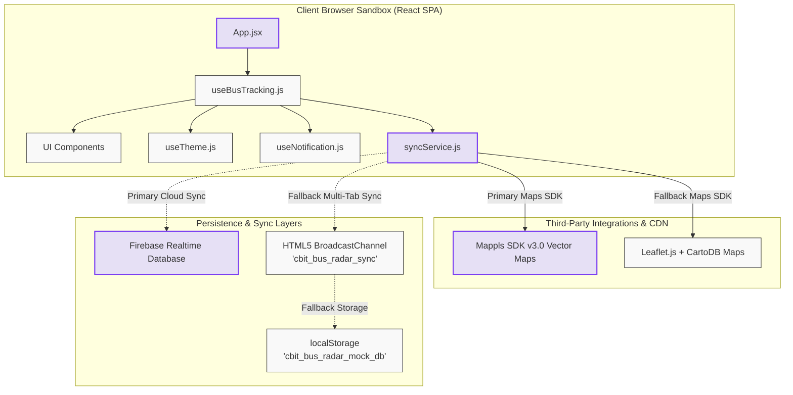
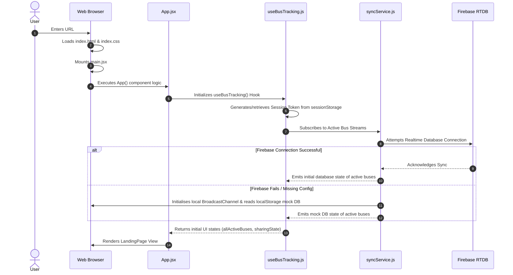
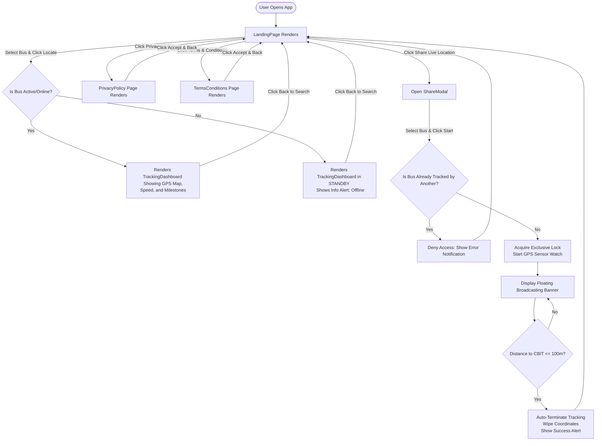
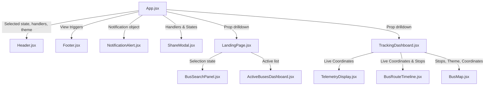
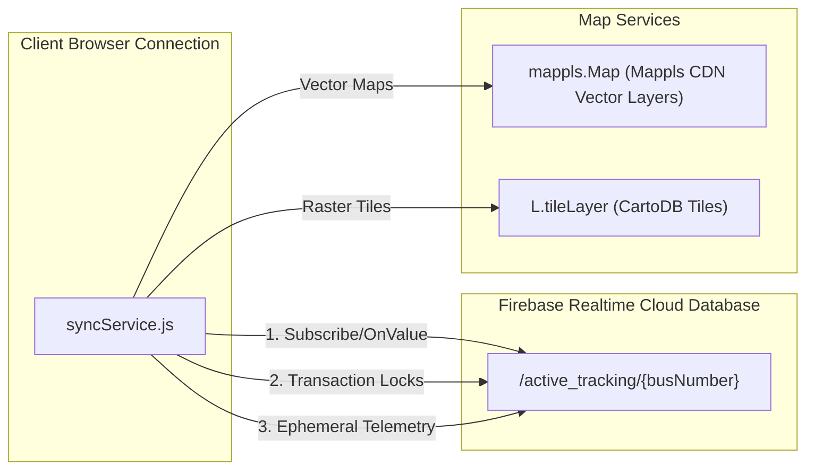
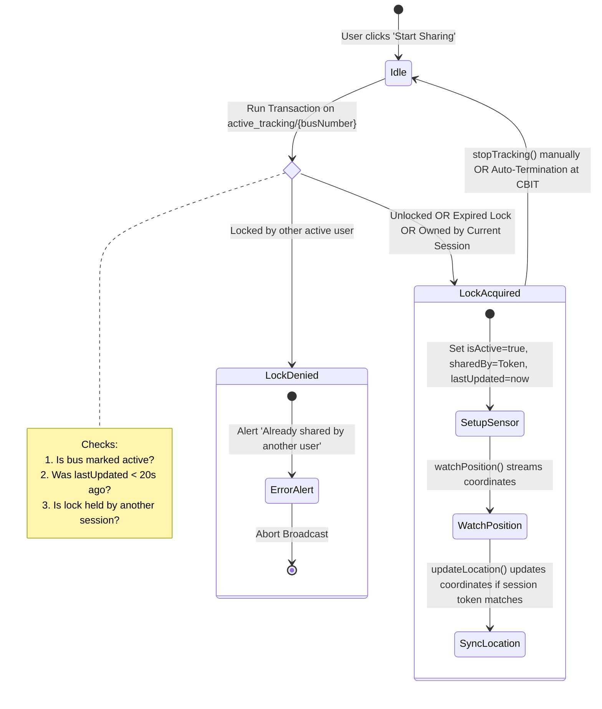
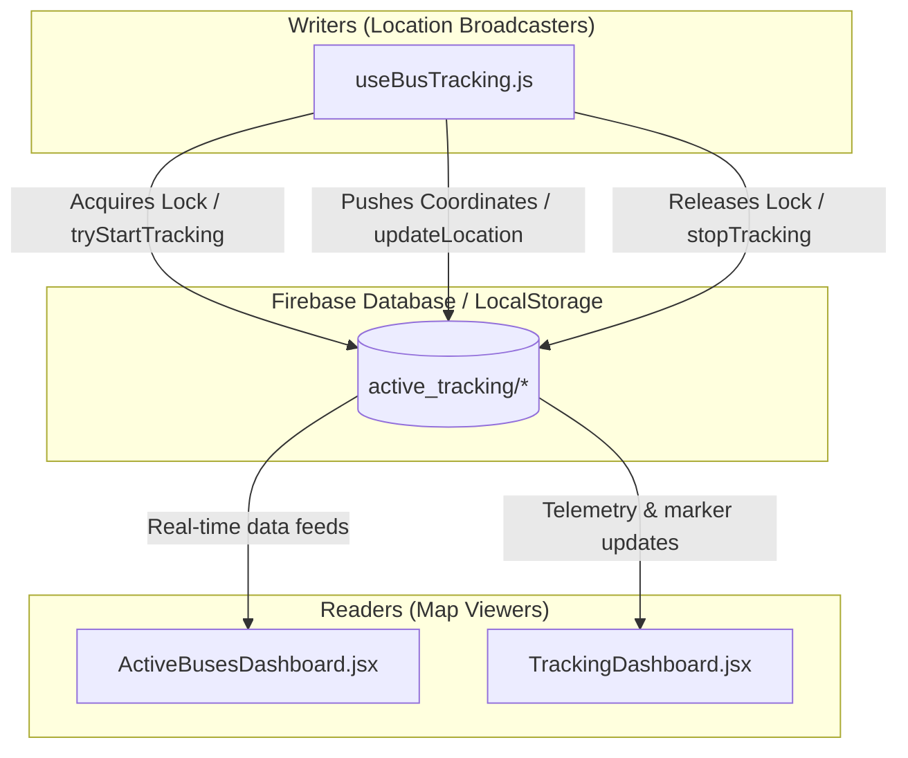
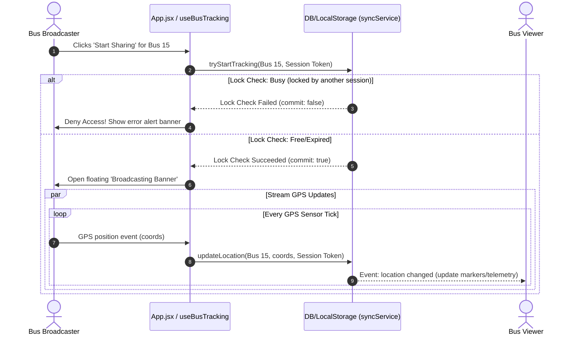
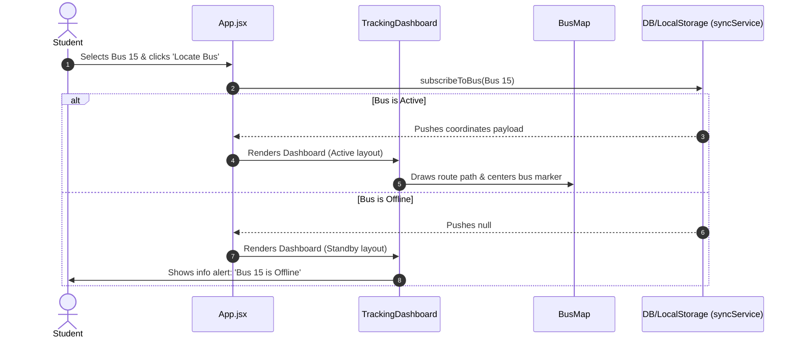

# Find My Bus: End-to-End System Flow Documentation

Welcome to the comprehensive, end-to-end technical system documentation for **Find My Bus**, a real-time student transit tracking application custom-built for **Chaitanya Bharathi Institute of Technology (CBIT)**. 

This document serves as an exhaustive architectural blueprint and runtime execution guide. It covers the entire system flow from initial page boot to live GPS telemetry broadcasting, lock acquisitions, database transactions, and client-side page rendering.

---

## 1. Project Architecture Overview

The **Find My Bus** application is engineered as a modern, lightweight, highly responsive client-side Single Page Application (SPA). It uses a hybrid synchronisation backend architecture that natively prioritises cloud synchronization but includes a robust browser sandbox fallback.



### Folder and File Directory Structure

*   **`root/`**
    *   `index.html`: Entry point HTML template. Injects Google Fonts (`Space Grotesk`, `Outfit`, `Inter`) and references `/src/main.jsx`.
    *   `package.json`: Manages scripts (`dev`, `build`, `lint`, `preview`), client-side dependencies (`firebase`, `lucide-react`, `react`, `react-dom`), and development builds (`vite`, `@vitejs/plugin-react`).
    *   `.env`: Local environment configuration variables storing secret credentials for Firebase and MapMyIndia (Mappls).
    *   `vite.config.js`: Vite configuration file for transpiling React, resolving imports, and bundling production assets.
*   **`src/`**
    *   `main.jsx`: Reconciles the React component tree into the DOM root node inside a `<StrictMode>` wrapper.
    *   `App.jsx`: Global controller component. Governs root routing views, active view transitions, layout rendering (Header/Footer), broadcasting alerts, and state synchronization.
    *   `App.css`: Root css rules containing utility structures.
    *   **`config/`**
        *   [config.js](file:///c:/RaghavendraAnirudh/Projects/find-my-bus/src/config/config.js): Aggregates global configuration tokens, binding `import.meta.env` environment variables into a single read-only JavaScript object (`CONFIG`).
    *   **`constants/`**
        *   [routesData.js](file:///c:/RaghavendraAnirudh/Projects/find-my-bus/src/constants/routesData.js): The central route directory and geographic data ledger containing coordinates (`STOP_COORDINATES`, `CBIT_COORDS`), route descriptions (raw stop listings for Junior and Senior buses), and geometric computation utilities.
    *   **`hooks/`**
        *   [useTheme.js](file:///c:/RaghavendraAnirudh/Projects/find-my-bus/src/hooks/useTheme.js): Custom hook interfacing with `localStorage` and `document.documentElement` attributes to control theme toggles (`light`/`dark`).
        *   [useNotification.js](file:///c:/RaghavendraAnirudh/Projects/find-my-bus/src/hooks/useNotification.js): Custom hook managing micro-notification states, automatic self-erasure timeouts, and alert dispatches.
        *   [useBusTracking.js](file:///c:/RaghavendraAnirudh/Projects/find-my-bus/src/hooks/useBusTracking.js): The central business logic engine. Governs geolocation streaming hooks, distance checks, active search filters, auto-termination gates, and modal management.
    *   **`services/`**
        *   [syncService.js](file:///c:/RaghavendraAnirudh/Projects/find-my-bus/src/services/syncService.js): The core data layer interface. Orchestrates live Firebase Realtime Database connections (with atomic transitions and locking transactions) and gracefully falls back to multi-tab local sandboxes when Firebase is unreachable.
    *   **`components/`**
        *   **`layout/`**
            *   [Header.jsx](file:///c:/RaghavendraAnirudh/Projects/find-my-bus/src/components/layout/Header.jsx): Sticky brand navigation bar with theme switches and share options.
            *   [Footer.jsx](file:///c:/RaghavendraAnirudh/Projects/find-my-bus/src/components/layout/Footer.jsx): Informative footer listing system telemetry stats, source repositories, academic schedules, and legal links.
        *   **`search/`**
            *   [BusSearchPanel.jsx](file:///c:/RaghavendraAnirudh/Projects/find-my-bus/src/components/search/BusSearchPanel.jsx): Dropdown interface matching routes to search configurations.
        *   **`bus/`**
            *   [ActiveBusesDashboard.jsx](file:///c:/RaghavendraAnirudh/Projects/find-my-bus/src/components/bus/ActiveBusesDashboard.jsx): Grid showcasing live cards of active commuter buses on the road.
            *   [TelemetryDisplay.jsx](file:///c:/RaghavendraAnirudh/Projects/find-my-bus/src/components/bus/TelemetryDisplay.jsx): High-resolution display cards for tracking current transit speed (km/h) and distance to target campus.
            *   [BusRouteTimeline.jsx](file:///c:/RaghavendraAnirudh/Projects/find-my-bus/src/components/bus/BusRouteTimeline.jsx): Interactive visual path timeline listing upcoming, current, and passed stations.
        *   **`map/`**
            *   [BusMap.jsx](file:///c:/RaghavendraAnirudh/Projects/find-my-bus/src/components/map/BusMap.jsx): Interactive mapping system integrating MapMyIndia (Mappls Web SDK v3.0 Vector Layers) and fallback Leaflet tiles matching light/dark themes.
        *   **`ui/`**
            *   [NotificationAlert.jsx](file:///c:/RaghavendraAnirudh/Projects/find-my-bus/src/components/ui/NotificationAlert.jsx): Fixed banner overlay displaying styled alert feedback.
            *   [ShareModal.jsx](file:///c:/RaghavendraAnirudh/Projects/find-my-bus/src/components/ui/ShareModal.jsx): Overlay selection prompt enabling GPS location sharing for selected buses.
    *   **`styles/`**
        *   [index.css](file:///c:/RaghavendraAnirudh/Projects/find-my-bus/src/styles/index.css): Monolithic stylesheet mapping design tokens (Notion navy and colors, curves, shadows, fonts, transitions) and responsive layouts.

---

## 2. Application Startup Flow

When the user enters the site, the browser executes the following boot sequence:



### Startup Initialization Steps

1.  **Session Token Creation:** Inside [useBusTracking.js](file:///c:/RaghavendraAnirudh/Projects/find-my-bus/src/hooks/useBusTracking.js#L5-L12), an immediately invoked function expression (IIFE) checks the browser's `sessionStorage` for `"cbit_bus_session_token"`. If none exists, it generates a cryptographically random, alphanumeric session key:
    ```js
    const sessionToken = (() => {
      let token = sessionStorage.getItem("cbit_bus_session_token");
      if (!token) {
        token = `session_${Math.random().toString(36).substring(2, 11)}`;
        sessionStorage.setItem("cbit_bus_session_token", token);
      }
      return token;
    })();
    ```
    This token is crucial for the application's lock acquisition and data ownership model.
2.  **Environment Variable & Config Load:** Vite loads variables prefixed with `VITE_` from `.env`. These are made available in `CONFIG` via [config.js](file:///c:/RaghavendraAnirudh/Projects/find-my-bus/src/config/config.js).
3.  **Database Connection Attempt:** [syncService.js](file:///c:/RaghavendraAnirudh/Projects/find-my-bus/src/services/syncService.js#L13-L23) attempts to initialize the Firebase instance using `CONFIG.firebaseConfig`. If successful, it exposes the live database reference. Otherwise, it logs a warning and falls back to a sandbox environment using the `BroadcastChannel` `"cbit_bus_radar_sync"` and local state reads.
4.  **Timer Loop Registration:** In [useBusTracking.js](file:///c:/RaghavendraAnirudh/Projects/find-my-bus/src/hooks/useBusTracking.js#L38-L45), the client registers a global time synchronization scheduler. The hook updates the current time (`now` state variable) every 5 seconds to ensure fresh data.
5.  **All-Bus Synchronization Hook:** A React `useEffect` inside `useBusTracking.js` calls `syncService.subscribeToAllBuses()`, setting up a real-time event listener that pushes any tracking updates directly to the component state, updating the active bus grids.

---

## 3. User Journey Flow

This section details how users interact with the app, covering standard navigation paths, redirects, and rendering decisions.



### Route-Guards & Dynamic Navigation

The application avoids heavy, complex routing libraries like React Router. Instead, it handles routing programmatically in the root layout via conditional state rendering. The app defines three main view states (`"main"`, `"privacy"`, `"terms"`) alongside the queried route details object (`activeSearchBus`).

*   **Privacy Guard / Terms View**: Clicking footer policy links updates the `activeView` state to `"privacy"` or `"terms"`. The app renders the matching legal page and scrolls to the top of the window.
*   **Locating Guard (Search View vs. Dashboard)**:
    *   If `activeSearchBus` is `null`, the dashboard container is replaced with the `LandingPage` containing the search controls and active cards.
    *   If `activeSearchBus` contains a valid route object, `TrackingDashboard` takes over the entire central viewport, changing the browser tab title to reflect the tracked route (e.g., `15: BOD UPPAL - Find My Bus`).

---

## 4. Page-by-Page Analysis

Since the application acts as an SPA using conditional state switching, we can define the pages by their logical component views.

---

### Landing Page View
*   **Path/Trigger:** `activeView === "main"` and `activeSearchBus === null`
*   **Purpose:** The central landing portal of the app. Introduces the service, displays a search widget, and lists all active buses on the road.
*   **Components Used:** [LandingPage.jsx](file:///c:/RaghavendraAnirudh/Projects/find-my-bus/src/pages/LandingPage.jsx), [Header.jsx](file:///c:/RaghavendraAnirudh/Projects/find-my-bus/src/components/layout/Header.jsx), [BusSearchPanel.jsx](file:///c:/RaghavendraAnirudh/Projects/find-my-bus/src/components/search/BusSearchPanel.jsx), [ActiveBusesDashboard.jsx](file:///c:/RaghavendraAnirudh/Projects/find-my-bus/src/components/bus/ActiveBusesDashboard.jsx), [Footer.jsx](file:///c:/RaghavendraAnirudh/Projects/find-my-bus/src/components/layout/Footer.jsx).
*   **API Calls / Sync Triggers:**
    *   Subscribes to all nodes in the database under `active_tracking` via `syncService.subscribeToAllBuses`.
*   **State Management:**
    *   `selectedBusNumber`: Selected bus route string in the dropdown search.
    *   `allActiveBuses`: Dynamic collection of active buses updated by the database.
*   **User Interactions:**
    *   *Select Route:* Click the dropdown menu to choose a route.
    *   *Locate:* Triggers search to open the tracking deck.
    *   *Live Commute Cards:* Clicking on any active bus card directly loads that bus into the tracking dashboard.
    *   *Share Location:* Opens the broadcast config modal.
*   **Navigation:** Can transition to `PrivacyPolicy`, `TermsConditions`, or `TrackingDashboard`.

---

### Tracking Dashboard View
*   **Path/Trigger:** `activeView === "main"` and `activeSearchBus !== null`
*   **Purpose:** Live tracking control deck. Displays route stop coordinates, visual timelines, and active GPS coordinates on vector maps.
*   **Components Used:** [TrackingDashboard.jsx](file:///c:/RaghavendraAnirudh/Projects/find-my-bus/src/pages/TrackingDashboard.jsx), [TelemetryDisplay.jsx](file:///c:/RaghavendraAnirudh/Projects/find-my-bus/src/components/bus/TelemetryDisplay.jsx), [BusRouteTimeline.jsx](file:///c:/RaghavendraAnirudh/Projects/find-my-bus/src/components/bus/BusRouteTimeline.jsx), [BusMap.jsx](file:///c:/RaghavendraAnirudh/Projects/find-my-bus/src/components/map/BusMap.jsx).
*   **API Calls / Sync Triggers:**
    *   Subscribes to the specific bus path `active_tracking/${busNumber}` via `syncService.subscribeToBus`.
    *   Loads third-party map scripts from Mappls or Leaflet CDNs.
*   **State Management:**
    *   `liveBusCoordinates`: Dynamic state storing the selected bus coordinates (lat, lng, speed, heading).
*   **User Interactions:**
    *   *Map Interactions:* Zoom and pan controls.
    *   *Back to Search:* Releases the searched bus selection and returns the user to the landing dashboard.
*   **Navigation:** Navigates back to the main search view of `LandingPage`.

---

### Privacy Policy View
*   **Path/Trigger:** `activeView === "privacy"`
*   **Purpose:** Displays user data policy, telemetry details, and auto-erasure rules.
*   **Components Used:** [PrivacyPolicy.jsx](file:///c:/RaghavendraAnirudh/Projects/find-my-bus/src/pages/PrivacyPolicy.jsx).
*   **User Interactions:**
    *   *Accept & Back:* Returns the user to the main landing page.

---

### Terms & Conditions View
*   **Path/Trigger:** `activeView === "terms"`
*   **Purpose:** Outlines acceptable usage guidelines, coordinate spoofing policies, and lock duration parameters.
*   **Components Used:** [TermsConditions.jsx](file:///c:/RaghavendraAnirudh/Projects/find-my-bus/src/pages/TermsConditions.jsx).
*   **User Interactions:**
    *   *Accept & Back:* Returns the user to the main landing page.

---

## 5. Component Flow

The flow of data in the React tree is strictly unidirectional, managed by the parent controller `App.jsx` and the custom hook `useBusTracking.js`.



### Data Flow Patterns

*   **Telemetry Pipeline:** Real-time coordinates from `syncService` are caught by the `useBusTracking` hook inside `App.jsx` and saved to the `liveBusCoordinates` state. These coordinates are passed down to:
    *   `TelemetryDisplay` to convert speed metrics and calculate distance to CBIT.
    *   `BusRouteTimeline` to find the nearest bus stop and determine which stops the bus has already passed.
    *   `BusMap` to update the physical coordinate coordinates of the bus marker and center the view.
*   **Action Propagation:** Child nodes notify the parent hook of state updates (like route selections or modal toggles) using callback functions like `setSelectedBusNumber`, `onSearch`, and `onBack`.

---

## 6. Backend & API Flow

The application interfaces with backend databases and mapping APIs using specialized services.



### 1. Firebase Realtime Database Telemetry Schema
The app maps live transport data to paths in the Realtime Database. The root directory is `/active_tracking`, with child nodes structured by bus route number:

```json
{
  "active_tracking": {
    "15": {
      "isActive": true,
      "sharedBy": "session_a9f838j2s",
      "routeNumber": "BOD UPPAL",
      "lastUpdated": 1719875640232,
      "latitude": 17.4062,
      "longitude": 78.5670,
      "speed": 11.2,
      "heading": 182
    }
  }
}
```

*   **Why/When Called:**
    *   `subscribeToAllBuses()`: Establishes a permanent WebSocket listener (`onValue`) on `/active_tracking` to populate the landing page's active bus grid.
    *   `subscribeToBus(busNumber)`: Listens to updates at `/active_tracking/{busNumber}` to refresh map markers and telemetry views.
    *   `tryStartTracking(busNumber)`: Initiates a database write transaction to acquire a route broadcast lock.
    *   `updateLocation(busNumber)`: Sends GPS coordinates to `/active_tracking/{busNumber}` during active tracking.
    *   `stopTracking(busNumber)`: Cleans up the database node, releasing the lock.

---

### 2. MapMyIndia (Mappls) Vector Map API
*   **Endpoints Called:** Injected vector rendering SDK:
    `https://sdk.mappls.com/map/sdk/web?v=3.0&access_token={API_KEY}&layer=vector`
*   **Why/When Called:** Loaded on demand when mounting the `BusMap` component if a `mapplsKey` is present in the configurations.
*   **Payload structure:** The map initializes vector tiles. Custom HTML elements are injected into markers (`mappls.Marker`) to render styled icons for CBIT, bus stops, and the live bus position.

---

### 3. Leaflet & CartoDB Maps (Raster Fallback)
*   **Endpoints Called:**
    *   Leaflet Styles: `https://unpkg.com/leaflet@1.9.4/dist/leaflet.css`
    *   Leaflet Scripts: `https://unpkg.com/leaflet@1.9.4/dist/leaflet.js`
    *   Light Tiles: `https://{s}.basemaps.cartocdn.com/light_all/{z}/{x}/{y}{r}.png`
    *   Dark Tiles: `https://{s}.basemaps.cartocdn.com/dark_all/{z}/{x}/{y}{r}.png`
*   **Why/When Called:** Acts as a fallback map engine if the MapMyIndia API fails or if no access token is configured.

---

## 7. Authentication & Authorization Flow

The application does not use traditional user accounts (like email/password sign-up). Instead, it implements a **decentralized token authorization model** that controls write permissions for bus route tracking. This model uses an **exclusive transaction-locking system** to ensure only one user can broadcast location data for a specific bus route at a time.



### Exclusive Lock Lifecycle

1.  **Authorization Check:** The client session request triggers `syncService.tryStartTracking(busNum, routeName, sessionToken)`.
2.  **Transaction Evaluation:** In Firebase, a database transaction checks the target path `/active_tracking/{busNumber}`:
    ```js
    const result = await runTransaction(dbRef, (currentData) => {
      const now = Date.now();
      if (
        currentData &&
        currentData.isActive &&
        now - currentData.lastUpdated < 20000 &&
        currentData.sharedBy !== sessionToken
      ) {
        // Abort: Route is locked by an active session
        return;
      }
      // Success: Acquire or renew the lock
      return {
        isActive: true,
        sharedBy: sessionToken,
        routeNumber: routeName,
        lastUpdated: now,
        latitude: currentData ? currentData.latitude || null : null,
        longitude: currentData ? currentData.longitude || null : null,
        speed: currentData ? currentData.speed || 0 : 0,
        heading: currentData ? currentData.heading || 0 : 0
      };
    });
    ```
3.  **Lock Expiry & Heartbeat:** Locks automatically expire after **20 seconds** without an update. If a driver's app crashes or loses internet coverage, the next request will override the stale lock, preventing orphan states.
4.  **Local Sandbox Validation:** The sandbox fallback mimics this behavior by checking localStorage records and broadcasting updates across tabs to keep views in sync.

---

## 8. Database Flow

The following schema maps how different components interact with nodes in the database:



*   **`active_tracking/{busNumber}`**:
    *   **Writers:** Only the client holding the session lock can update coordinates and metadata at this path.
    *   **Readers:**
        *   `ActiveBusesDashboard.jsx` reads `/active_tracking` to display active buses on the landing page.
        *   `TrackingDashboard.jsx` reads `/active_tracking/{busNumber}` to update map markers, calculate speed, and show route progress.

---

## 9. Business Logic Analysis

### Core Business Workflows

```
GPS Position Captured 
   |
   +--> Distance calculation to CBIT Campus via Haversine formula
   |
   +--> Velocity Conversion: meters/second converted to km/h (speed * 3.6)
   |
   +--> Database Write Request: updateLocation(coordinates, token)
   |
   +--> CBIT Check: If distance <= 100 meters, trigger auto-termination
```

### Critical Functions & Services

| Function | File | Description |
| :--- | :--- | :--- |
| `getTimelineMilestoneStates()` | [BusRouteTimeline.jsx](file:///c:/RaghavendraAnirudh/Projects/find-my-bus/src/components/bus/BusRouteTimeline.jsx#L3-L25) | Calculates the nearest stop to the bus's current location and marks all preceding stops as "passed". |
| `getDistanceKm()` | [routesData.js](file:///c:/RaghavendraAnirudh/Projects/find-my-bus/src/constants/routesData.js#L536-L548) | Calculates the great-circle distance between coordinates using the Haversine formula. |
| `getInterpolatedPath()` | [routesData.js](file:///c:/RaghavendraAnirudh/Projects/find-my-bus/src/constants/routesData.js#L551-L577) | Linearly interpolates coordinates between stops for smooth path rendering. |
| `tryStartTracking()` | [syncService.js](file:///c:/RaghavendraAnirudh/Projects/find-my-bus/src/services/syncService.js#L146-L216) | Uses database transactions to check and acquire exclusive broadcast locks. |

---

## 10. Visual Flow Diagrams

### Sequence Diagram: Sharing Location & Lock Acquisition

The diagram below shows the message flow during location sharing and lock verification.



---

## 11. Sequence Diagrams: Locating & Tracking

This sequence diagram details the database query cycle when a student views a bus route.



---

## 12. Potential Issues & Improvements

While the application is well-structured and performant, we have identified several bottlenecks and areas for improvement:

1.  **Lack of Real-Time Driver Authentication**:
    *   **Risk:** Any user can select a bus and broadcast spoofed GPS coordinates, potentially misleading students.
    *   **Recommendation:** Implement basic authentication or role-based access for verified drivers using tools like Firebase Auth, reserving location broadcasting permissions for authorized accounts.
2.  **GPS Telemetry Jitter & Accuracy Issues**:
    *   **Risk:** Raw GPS streams (`navigator.geolocation.watchPosition`) often suffer from accuracy drift and signal dropouts, causing map markers to jump around.
    *   **Recommendation:** Apply a smoothing algorithm (like a Kalman Filter or a moving average window) to coordinate inputs before sending them to the database.
3.  **No Map Routing Lines**:
    *   **Risk:** The current implementation draws direct lines between stops, ignoring actual roads.
    *   **Recommendation:** Use the Mappls Directions API or Leaflet Routing Machine to calculate and render the actual driving path along the road network.
4.  **Database Overhead from Polling**:
    *   **Risk:** Multiple concurrent viewers querying active buses can generate high database read volume, potentially exceeding free tier limits on Firebase RTDB.
    *   **Recommendation:** Implement query limits, paginate active dashboard feeds, or set up a cloud function to cache list summaries for read operations.

---

## 13. Developer Onboarding Guide

### "Start Here" Files

If you are new to the codebase, explore these three files first to understand the application's core architecture:

1.  **[routesData.js](file:///c:/RaghavendraAnirudh/Projects/find-my-bus/src/constants/routesData.js)**: Contains all stops, coordinates, and route definitions. This data serves as the foundation for the mapping and search components.
2.  **[syncService.js](file:///c:/RaghavendraAnirudh/Projects/find-my-bus/src/services/syncService.js)**: Governs data persistence, synchronization, multi-tab local broadcasting, and database transaction locking.
3.  **[useBusTracking.js](file:///c:/RaghavendraAnirudh/Projects/find-my-bus/src/hooks/useBusTracking.js)**: Manages React state, initiates location sharing, and controls the auto-termination flow.

### Recommended Codebase Exploration Order

1.  **Configuration and Initialization:** Review `vite.config.js`, `.env`, and `config.js` to understand build targets, API variables, and runtime setup.
2.  **Data Synchronization:** Study `syncService.js` to learn how the database connection is initialized and how the local sandbox fallback is handled.
3.  **State and Hook Interactions:** Check `useBusTracking.js` to see how GPS data is processed, how distance checks are executed, and how variables are passed to components.
4.  **Landing Page Flow:** Trace the rendering lifecycle of `LandingPage.jsx`, focusing on the search interface and active bus dashboard.
5.  **Tracking Dashboard Flow:** Analyze `TrackingDashboard.jsx`, looking at how telemetry cards, timeline progress, and interactive map engines handle real-time coordinates.
